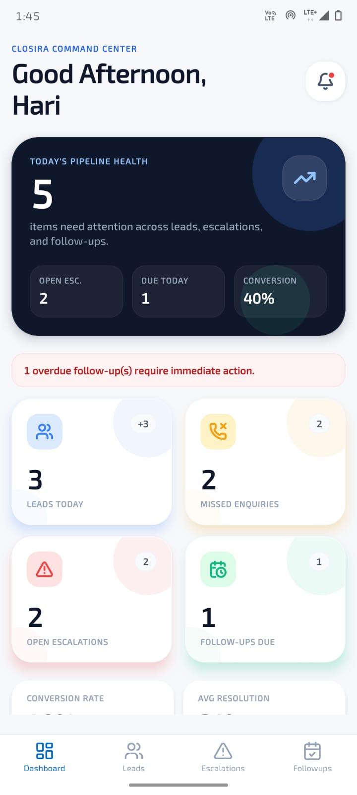
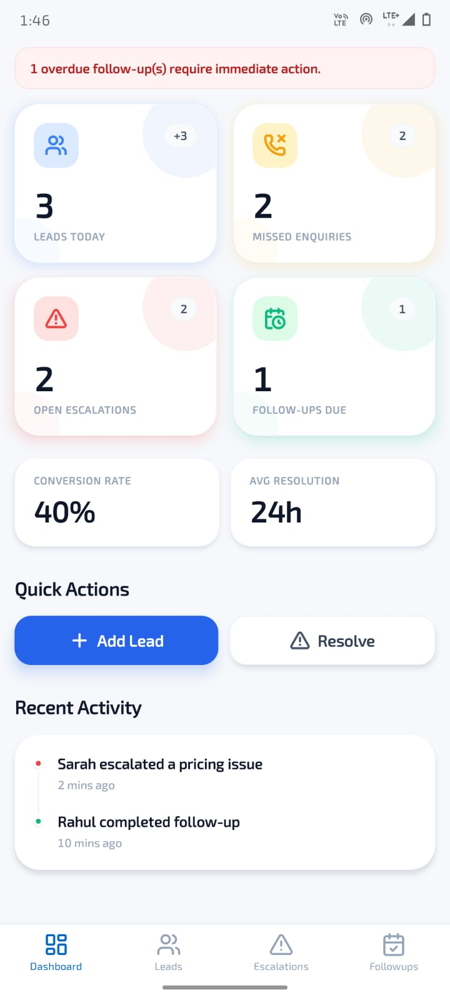
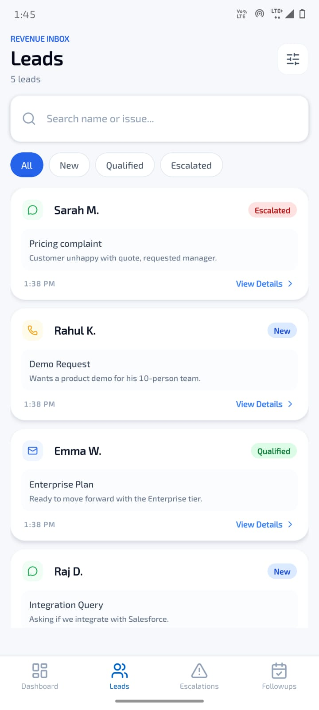
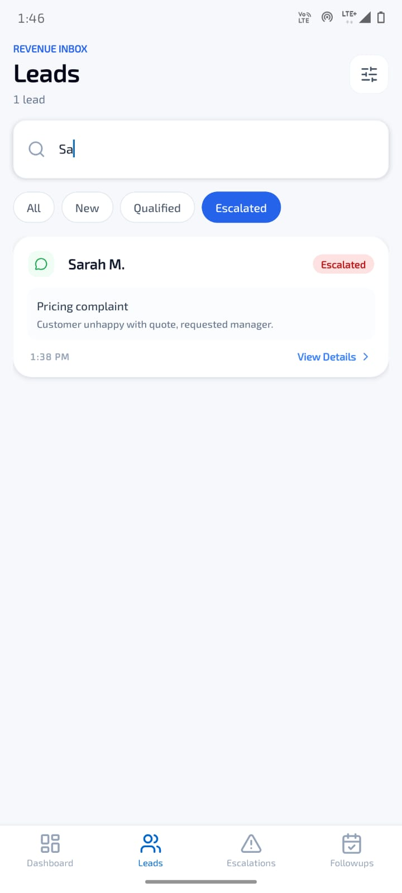
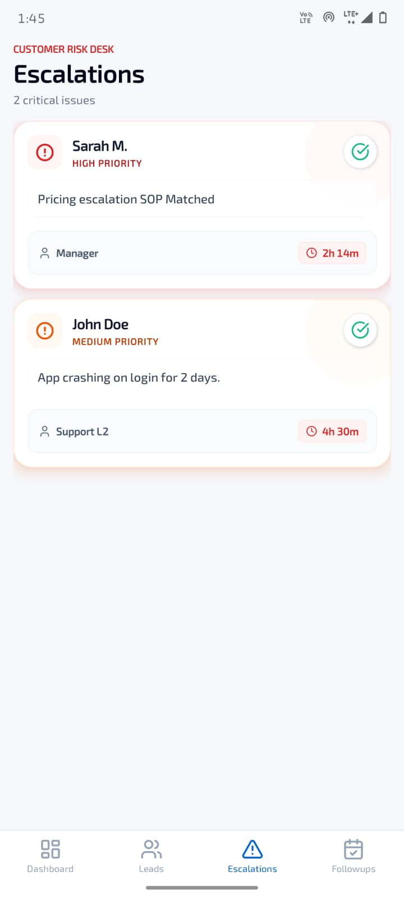
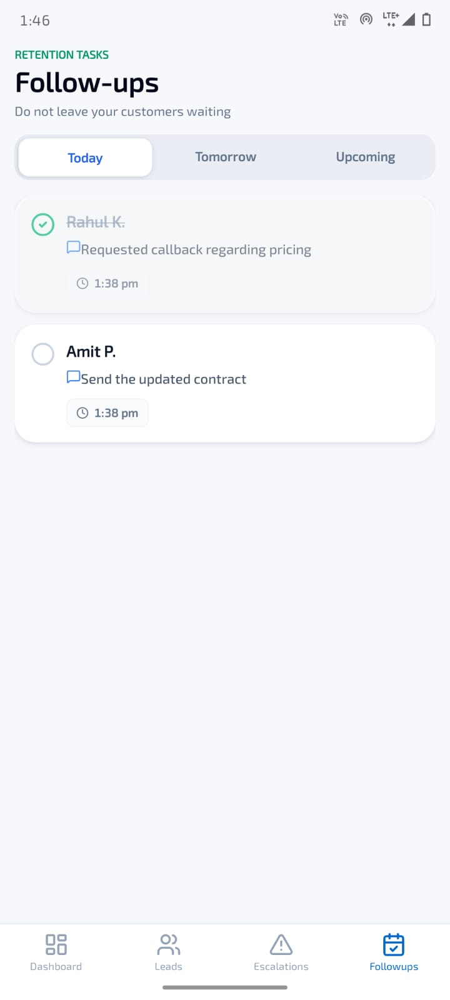
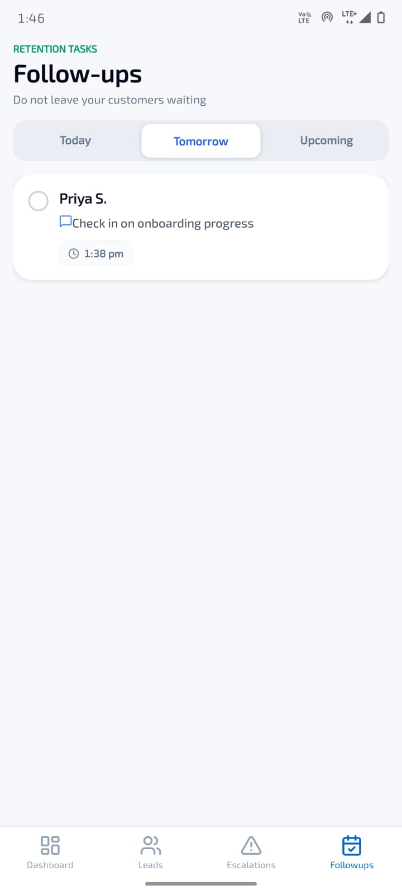
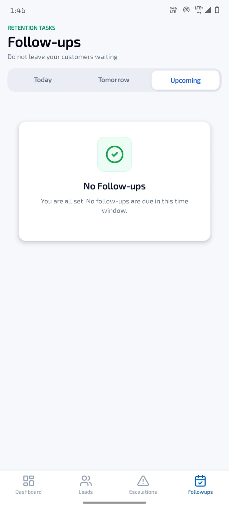

# ClosiraCRM

ClosiraCRM is an Expo SDK 54 mobile CRM prototype for teams that need a fast, honest view of customer follow-ups, new enquiries, and urgent escalations. The app is built around one simple idea: when a salesperson or support lead opens their phone, the next customer action should be obvious.

It is not a marketing landing page. It is the working mobile experience: dashboard, leads inbox, escalation desk, follow-up tracker, and conversation detail flow.

## Demo

Watch the walkthrough demo: [ClosiraCRM on YouTube](https://youtu.be/8XPKikwVMNI?si=rHvaJeypGH9GpdP0)

## Screenshots

<table>
  <tr>
    <td></td>
    <td></td>
    <td></td>
  </tr>
  <tr>
    <td></td>
    <td></td>
    <td></td>
  </tr>
  <tr>
    <td></td>
    <td></td>
    <td></td>
  </tr>
</table>

## What The App Includes

- Dashboard with a time-based greeting, pipeline health summary, KPI cards, overdue follow-up alert, quick actions, and recent activity.
- Revenue Inbox for leads with search, status filters, channel badges, and lead detail navigation.
- Customer Risk Desk for open escalations with priority, owner, SLA remaining, and resolve-ready cards.
- Follow-up tracker split into Today, Tomorrow, and Upcoming tabs.
- Conversation detail screen with AI analysis, chat bubbles, activity timeline, and a message composer.
- Mock CRM data for leads, escalations, and follow-ups so the app can run without a backend.
- Async loading, error, empty, and pull-to-refresh states across the main flows.

## Tech Stack

- Expo SDK 54
- React Native 0.81.5
- React 19.1
- TypeScript with strict mode
- React Navigation, bottom tabs, and native stack navigation
- Zustand for CRM state and KPI calculations
- NativeWind and Tailwind CSS for styling
- FlashList for performant lists
- Lucide React Native icons
- Expo StatusBar, Gesture Handler, Safe Area Context, Reanimated, and SVG support

## Project Structure

```text
App.tsx                         App shell, providers, navigation container
src/navigation/AppNavigator.tsx  Bottom tabs and conversation stack
src/screens/                     Dashboard, Leads, Escalations, Follow-ups, Conversation
src/components/                  Cards, badges, buttons, loading, empty, error, chat UI
src/store/crmStore.ts            Zustand store, async fetch simulation, mutations, KPIs
src/mock/data.ts                 Local CRM sample data
src/types/                       Shared TypeScript models
src/theme/tokens.ts              Colors, spacing, typography, shadows
src/utils/                       Logger, validators, formatters, hooks
assets/readme/                   README screenshots
```

## Data Model

The current app runs on local mock data:

- `Lead`: customer, channel, status, reason, received time, and summary.
- `Escalation`: customer, priority, assigned owner, SLA remaining, and issue.
- `Followup`: customer, due time, preview, completion status, overdue flag, and timeline group.

The store simulates API calls with loading states, validates incoming mock data, recalculates KPIs, and logs important actions. That makes the UI ready for a real API later without rewriting the screen logic.

## Getting Started

Install dependencies:

```bash
npm install
```

Start the Expo dev server:

```bash
npx expo start -c
```

Useful scripts:

```bash
npm run start
npm run android
npm run ios
npm run web
npm run lint
```

## Notes

This project currently targets Expo SDK 54, as defined in both `package.json` and `app.json`. The UI is intentionally operational: clean cards, clear urgency, simple navigation, and enough state handling to feel like a real CRM mobile workflow instead of a static mockup.
